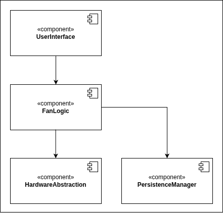

# Architektur

Schichtenmodell

• Der Schichtenansatz begünstigt die schrittweise Entwicklung von Systemen. Sobald eine
Schicht entwickelt worden ist, können einige der in dieser Schicht enthaltenen Dienste
für die Benutzer verfügbar gemacht werden.
• Diese Architektur ist veränderbar und portierbar
• Solange die Schnittstellen nicht verändert werden, kann man eine Schicht komplett
durch eine andere ersetzen
• Wenn sich die Schnittstellen einer Schicht hingegen ändern, wird davon nur die
angrenzende Schicht betroffen
• Da bei Schichtensystemen die maschinenabhängigen Eigenschaften in den unteren
Schichten angeordnet sind, können sie relativ leicht auf anderen Computern
implementiert werden, indem man die inneren, maschinenspezifischen Schichten
neu erstellt

**Verantwortlichkeiten der Komponenten:**

## Schnittstellendefinition

## Technologiestack

| Kategorie                | Technologie / Tool            | Begründung                                                                                                   |
|--------------------------|-------------------------------|--------------------------------------------------------------------------------------------------------------|
| Sprache                  |                               |                                                                                                              |
| Buildsystem              |                               |                                                                                                              |
| Versionskontrolle        | Git + GitHub                  |                                                                                                              |
| Organisation, Tracking   |                               |                                                                                                              |
| IDE                      |                               |                                                                                                              |
| Ausgabe                  |                               |                                                                                                              |
| Dokumentation            |                               |                                                                                                              |
| Codeanalyse              |                               |                                                                                                              |
| Test-Framework           |                               |                                                                                                              |
| Frameworks, Bibliotheken |                               |                                                                                                              |

