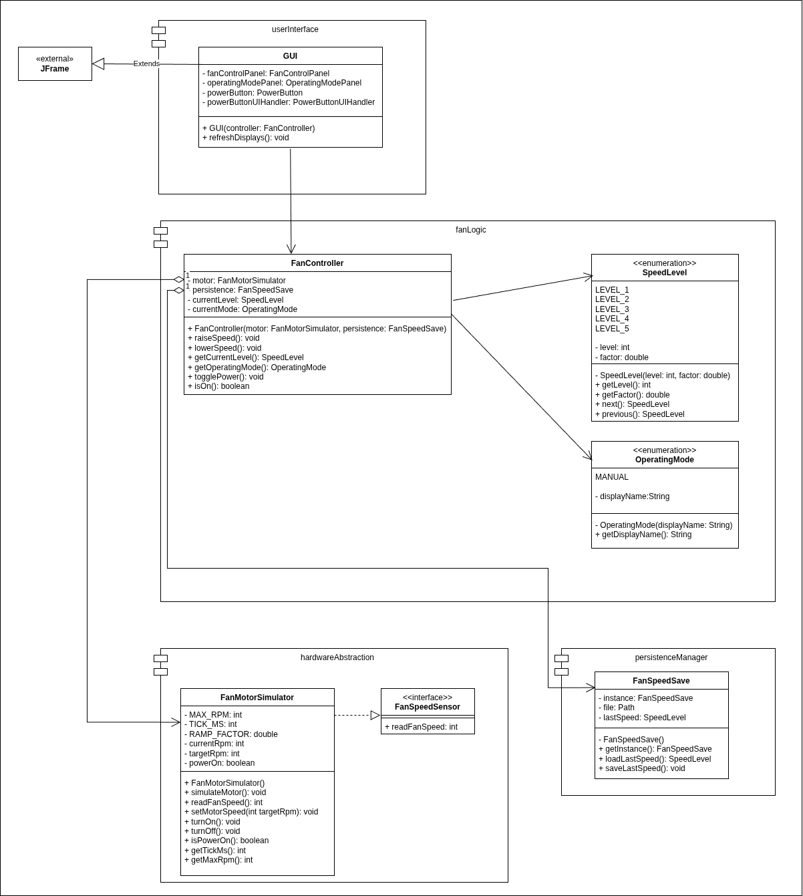
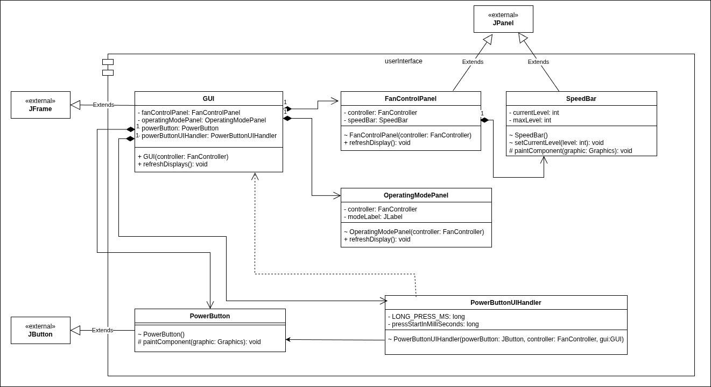
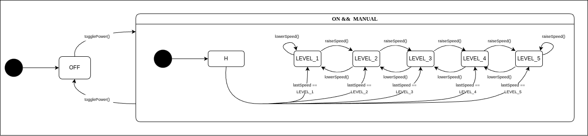
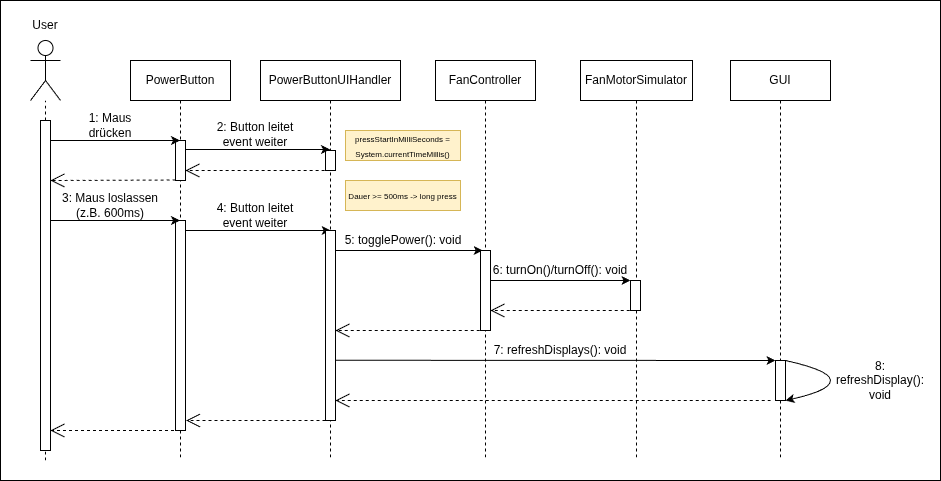

# Design

## Klassendiagramm

In der folgenden Abbildung ist das Klassendiagramm für das gewählte Systemdesign abgebildet. Es enthält die relevanten Methoden und Attribute der zentralen Klassen (mit allen Zugriffsmodifikatoren).  
Zur Übersichtlichkeit wurden in der Komponente userInterface die spezifischen Hilfsklassen `FanControlPanel`, `OperatingModePanel`, `PowerButton` und `PowerButtonUIHandler` auf die Hauptklasse GUI abstrahiert. Diese Klassen stehen im tatsächlichen System in einer Kompositionsbeziehung zur GUI und besitzen jeweils eine gerichtete Assoziation zum FanController.  
Bei diesem Entwurf wurde besonderer Wert auf das Einhalten einer sauberen Schichtenarchitektur und die Vermeidung zyklischer Abhängigkeiten zwischen den Komponenten gelegt.

In der folgenden Abbildung ist sind nun alle Klassen der Komponente UserInterface aufgezeichnet.

## Zustandsdiagramm: Manuelle Steuerung des Ventilators

## Sequenzdiagramm: Power Button Interaction

## Designpatterns

<table>
  <tr>
    <th>Klasse</th>
    <th>Design-Pattern</th>
    <th>Grund</th>
  </tr>
  <tr>
    <td>FanSpeedSave</td>
    <td>Singleton</td>
    <td>gewährleistet zentralen und konsistenten Zugriff auf den zuletzt genutzten speed level</td>
  </tr>
</table>
